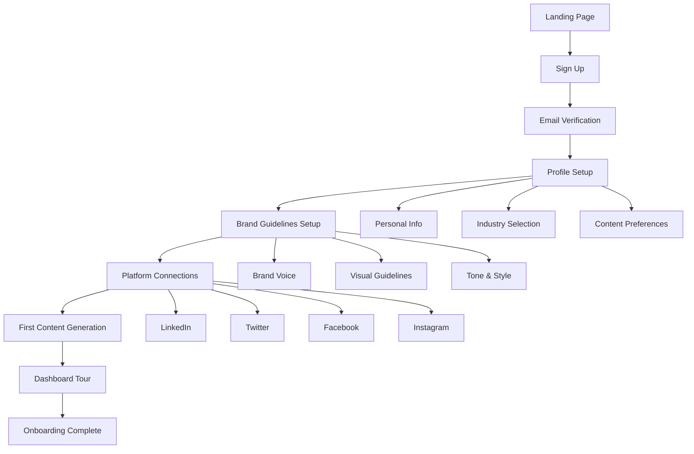
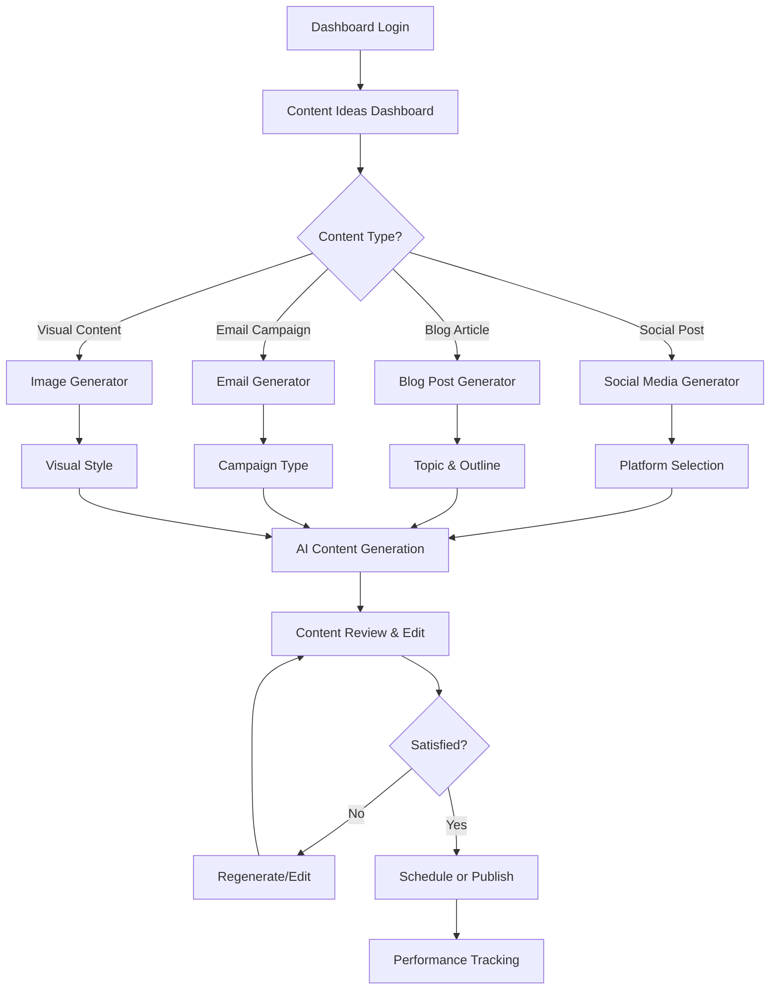
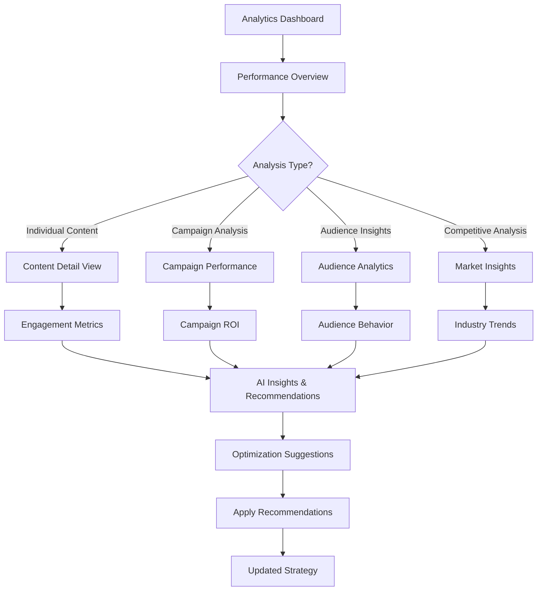
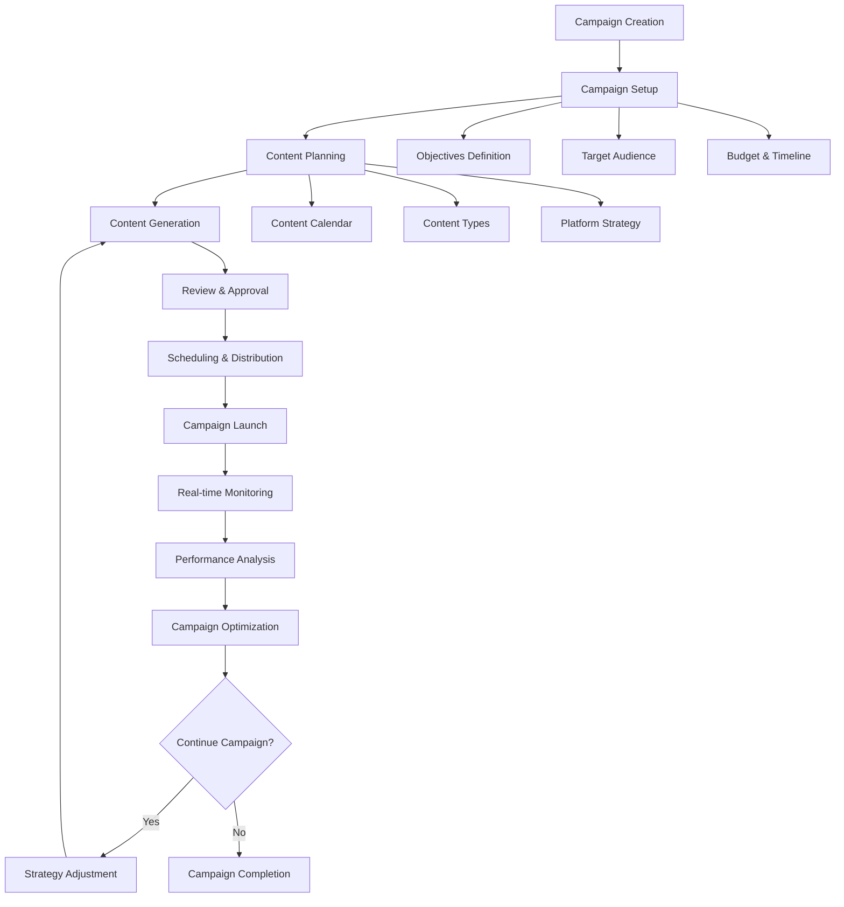
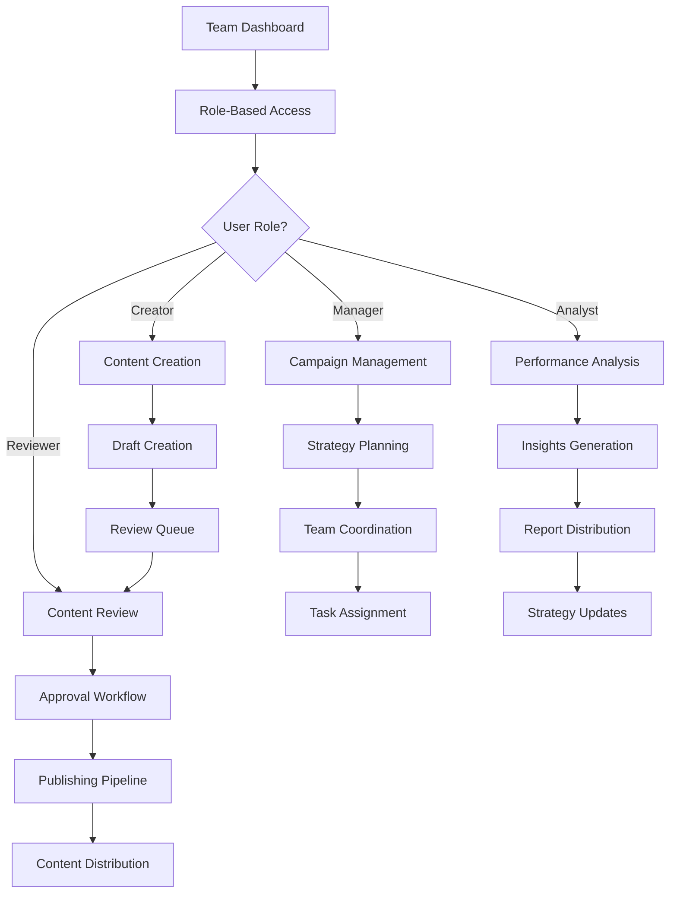
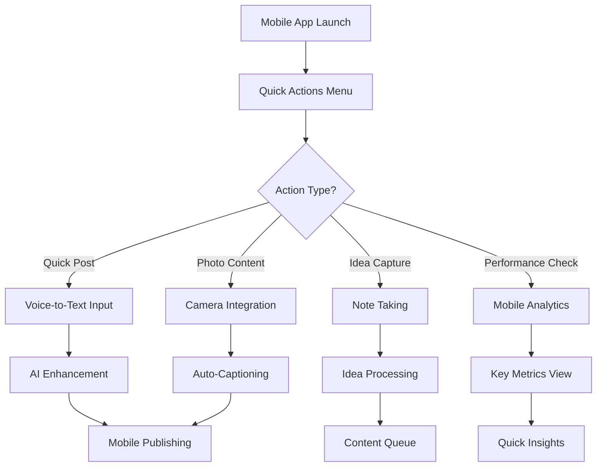
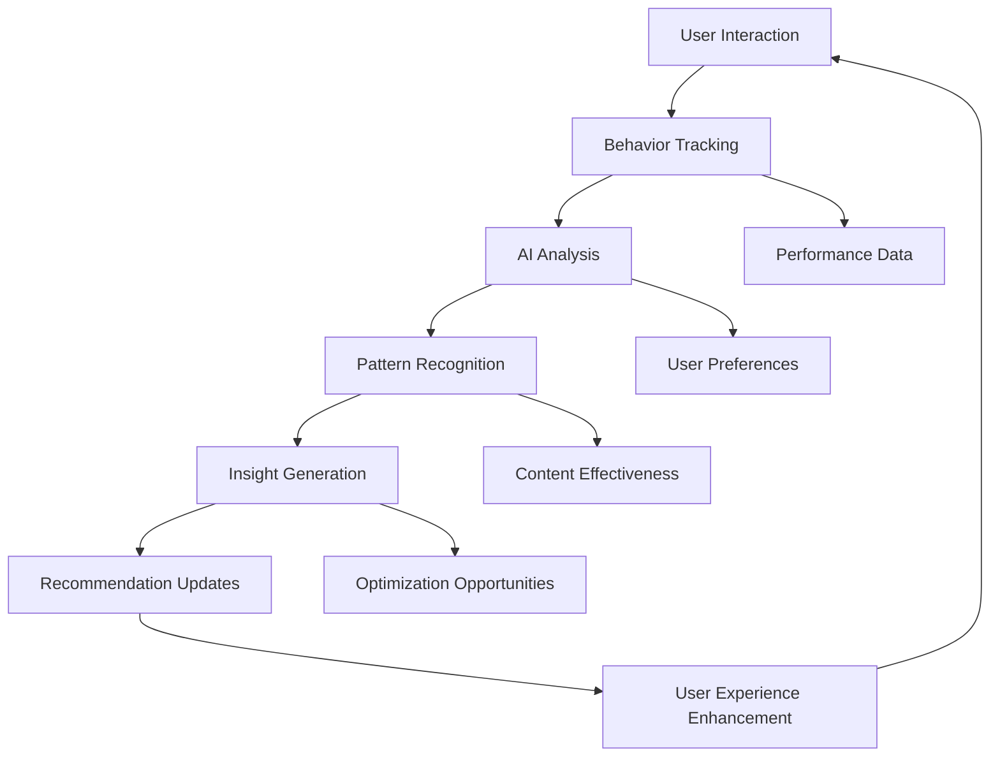

# SmartContent AI - User Journey Flows

## 🎯 User Personas and Journey Overview

### Primary User Personas

1. **Content Creator** - Individual creators, bloggers, social media managers
2. **Marketing Manager** - Enterprise marketing teams, campaign managers
3. **Brand Manager** - Multi-brand organizations, agencies
4. **Analytics Specialist** - Data-driven content strategists

## 🚀 Core User Journey Flows

### 1. New User Onboarding Flow

**Detailed Steps:**

1. **Landing Page Experience**
   - Value proposition presentation
   - Feature highlights with demos
   - Social proof and testimonials
   - Clear CTA for sign-up

2. **Registration Process**
   - Email/password or OAuth (Google, LinkedIn)
   - Email verification with welcome message
   - Account activation

3. **Profile Configuration**
   - Personal/company information
   - Industry and niche selection
   - Content creation goals
   - Audience demographics

4. **Brand Guidelines Setup**
   - Brand voice definition (professional, casual, authoritative)
   - Tone preferences (friendly, formal, conversational)
   - Key messaging and values
   - Visual brand elements (colors, fonts)

5. **Platform Integration**
   - Social media account connections
   - API permissions and scopes
   - Publishing preferences
   - Scheduling timezone setup

6. **First Content Creation**
   - Guided content generation tutorial
   - Template selection
   - AI-assisted prompt building
   - Content preview and editing

### 2. Daily Content Creation Flow

**Detailed Steps:**

1. **Dashboard Overview**
   - Performance metrics summary
   - Content calendar view
   - AI-generated insights and recommendations
   - Quick action buttons

2. **Content Type Selection**
   - Template gallery with previews
   - Platform-specific optimizations
   - Content length and format options
   - Audience targeting options

3. **AI-Powered Generation**
   - Smart prompt suggestions
   - Real-time content generation
   - Multiple variation options
   - Brand compliance checking

4. **Content Refinement**
   - Built-in editor with suggestions
   - Tone and style adjustments
   - SEO optimization recommendations
   - Hashtag and CTA suggestions

5. **Publishing & Scheduling**
   - Optimal timing recommendations
   - Cross-platform publishing
   - Automated scheduling
   - Campaign association

### 3. Content Performance Analysis Flow

**Detailed Steps:**

1. **Performance Dashboard**
   - Real-time engagement metrics
   - Trend analysis and comparisons
   - Top-performing content highlights
   - Audience growth tracking

2. **Deep Dive Analytics**
   - Content performance breakdown
   - Engagement pattern analysis
   - Audience demographic insights
   - Platform-specific metrics

3. **AI-Powered Insights**
   - Performance prediction models
   - Content optimization suggestions
   - Audience behavior patterns
   - Competitive benchmarking

4. **Strategy Optimization**
   - Automated A/B testing setup
   - Content calendar adjustments
   - Audience targeting refinements
   - Platform strategy updates

### 4. Campaign Management Flow

**Detailed Steps:**

1. **Campaign Planning**
   - Objective setting (awareness, engagement, conversion)
   - Target audience definition
   - Budget allocation and timeline
   - Success metrics identification

2. **Content Strategy Development**
   - Content calendar creation
   - Content mix optimization
   - Platform-specific adaptations
   - Messaging consistency planning

3. **Automated Content Creation**
   - Bulk content generation
   - Brand guideline enforcement
   - Cross-platform optimization
   - Quality assurance checks

4. **Campaign Execution**
   - Automated publishing schedules
   - Real-time performance monitoring
   - Dynamic content optimization
   - Audience engagement tracking

5. **Performance Optimization**
   - A/B testing implementation
   - Content performance analysis
   - Audience response evaluation
   - Strategy refinement

### 5. Team Collaboration Flow

**Detailed Steps:**

1. **Team Setup & Permissions**
   - Role-based access control
   - Workflow customization
   - Approval hierarchies
   - Collaboration tools integration

2. **Content Collaboration**
   - Shared content libraries
   - Version control and history
   - Comment and feedback systems
   - Real-time collaborative editing

3. **Approval Workflows**
   - Automated review assignments
   - Approval status tracking
   - Feedback integration
   - Publishing authorization

4. **Performance Sharing**
   - Automated reporting
   - Dashboard sharing
   - Insight distribution
   - Strategy alignment meetings

## 🎨 User Experience Principles

### 1. Simplicity First
- Minimal cognitive load
- Clear navigation paths
- Progressive disclosure
- Contextual help and guidance

### 2. AI-Powered Assistance
- Proactive suggestions
- Intelligent automation
- Predictive insights
- Continuous learning

### 3. Personalization
- Adaptive interfaces
- Customized workflows
- Personal preferences
- Learning from behavior

### 4. Real-time Feedback
- Instant performance updates
- Live collaboration features
- Immediate AI suggestions
- Dynamic content optimization

## 📱 Mobile Experience Flow

### Mobile-First Content Creation

**Mobile-Specific Features:**

1. **Voice-Powered Creation**
   - Voice-to-text content input
   - AI-powered transcription
   - Automatic formatting
   - Context-aware suggestions

2. **Camera Integration**
   - Instant photo capture
   - AI-generated captions
   - Brand-compliant filters
   - Automatic posting

3. **Offline Capabilities**
   - Draft synchronization
   - Offline content creation
   - Queue management
   - Background publishing

## 🔄 Feedback and Iteration Loops

### Continuous Improvement Flow

**Feedback Mechanisms:**

1. **Implicit Feedback**
   - Usage patterns analysis
   - Content performance correlation
   - Time-on-task measurements
   - Feature adoption rates

2. **Explicit Feedback**
   - User ratings and reviews
   - Feature request submissions
   - Satisfaction surveys
   - Support ticket analysis

3. **AI Learning Integration**
   - Preference learning algorithms
   - Content quality improvements
   - Personalization enhancements
   - Predictive accuracy increases

## 📊 Success Metrics and KPIs

### User Journey Success Indicators

1. **Onboarding Success**
   - Time to first content creation: < 10 minutes
   - Onboarding completion rate: > 85%
   - First week retention: > 70%

2. **Daily Usage Patterns**
   - Average session duration: 15-20 minutes
   - Content creation frequency: 3-5 pieces/week
   - Feature adoption rate: > 60%

3. **Content Performance**
   - Engagement rate improvement: > 40%
   - Time savings: > 70%
   - Content quality scores: > 8/10

4. **User Satisfaction**
   - Net Promoter Score: > 50
   - Customer satisfaction: > 4.5/5
   - Feature satisfaction: > 80%

This comprehensive user journey documentation ensures that every interaction with SmartContent AI is optimized for user success, engagement, and value delivery.